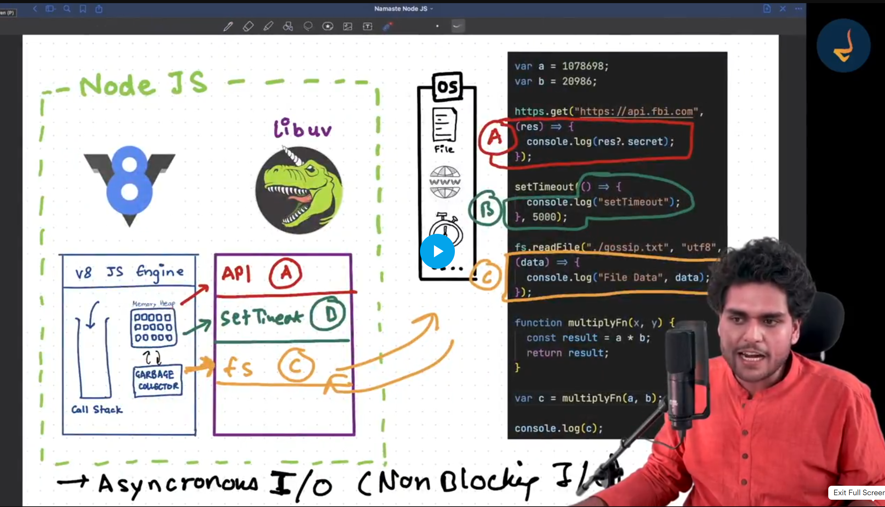

### Before understanding the Sync and Async execution we need to understand how they executed.


# Sync

    - In the case of Sync function execution Javascript has their engines like V8. In this cases V8 engine cannot require the any other librery they execute by them self.

``` js
Sync.js

    console.log("Hello World")
    var a = 10;
    var b = 20;
    function multiply(x, y) {
        const result = x * y;
        return result;
    }
    var c = multiply(a, b)
    console.log(c)

OUTPUT:
Hello World
200
```

- This is a example of the Syncronization code.
- Explain: 
    - first of all js engine start with the first line which is consol.log("Hello World) they immediatly execute that.
    - Now, V8 initialize the `a and b` variable to the `memory Heap`
    - Now, execute this line function multiply(x, y) { (Which means that add the function in the call stack)
    - Now Intialize the c and execute the mmultiply() function.
    - At the last print the output of that function.

# Async

- But in the Case of Async Function execution javascript cannot execute by the only use of the V8 Engines they need the `libUV` librery to do their work mean while they excute the some other code.




- From the image we understand the concept of Async function in detail.
    - First of all v8 engine intialize the variable `a & b`
    - Now, we have a API call which may take some time execute so we can say that this is a async execution but as we know `V8 engine is not capable to do a Async Task` so they give to the libUV to execute the Async task.
        - After giveing to the libUV, V8 will move ahead. whenever the execution will complete libUV give to the V8 engine and V8 engine Execute that.
    - Now, V8 goes to the setTimeout(), which is also a Async Task. so same process repete by the V8 engine like a API call.
    - Now, next task is read the file which is also a Async Task so same process repete by the V8 engine like a API call.
    - Now, we have a multiply function which is a Sync task so this is execute immediatly by the V8 engine.

    ``` js
    OUTPUT:
        Hello World
        Multiplication result is : 22637556228
        File Data: This is the file data
        Fetched data succesfully
        setTimeout called after 5 second
    ```

    `NOTE: At the time of execution of the code we have a Sync as well as Async task so in the case of Async task we know that V8 give to the libUV to execute the Async task so if libUV complete the task immidiatly like in the case of setTimeout(()=>{},0) then also this is executed by the V8 at the time when callstack has no globle execution context(means all the possible code was executed). In short Async task only execute by the V8 at the end of the full file Sync task executed by the V8 engine. for the batter understanding show the upper Async image and in that set the timeout to the 0 and show the result.`