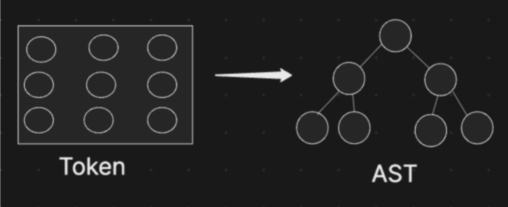
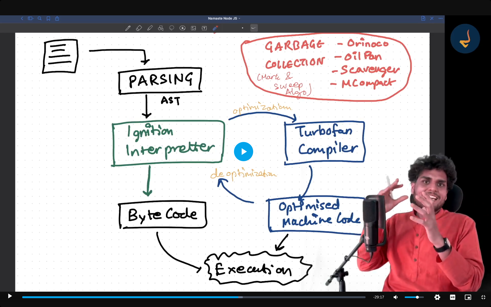

## What is V8?

- `V8 is Google's open source high-performance javascript and webAssembly engine, written in C++.`
- it is used in Chrome and Node.js, among others. it implements `ECMAScript` and `WebAssembly`, and runs on Windows, macOS and Linux Systems that uses x64, IA-32 or ARM Processors.

- `V8 can be embedded into any C++ application.`

# Architecture

- When we give the code to the V8 engine, V8 engine will proccess them into some stages.

  ## Stage 1: PARSING

- #### (i) Laxical Analysis ( Tokenization )

  - In the laxical analysis V8 engine `convert the code in the tokens.`

  - ### Code -> Tokens

    - Purpose The main goal of lexical analysis is to break down the raw JavaScript
        code into manageable pieces called tokens.

    - Tokenization is the process of converting code into a series of
        tokens. Each token represents a fundamental element of the language, such
        as keywords, operators, identifiers, and literals.

    - Tokenization helps the V8 engine to read and understand
        the code more effectively by breaking it down into smaller, more manageable
        pieces. This step is crucial for further analysis and compilation.

- #### (ii) Syntex Analysis ( Parsing )

  - In the Syntext Analysis Tokens which is generated in the laxical analysis is converted into the `AST: Abstract Syntext Tree`

        

  - For understand the concept in detail visit the website [AST Explorer](https://astexplorer.net/)

  - `Syntext error Fact: If V8 cannot generate the AST: Abstact Syntext Tree then they throw a error which is known as a Syntex error.`

  ## Interpreter and Compilation

  - Interpreted Languages:
    - Definition These languages are executed line by line. The interpreter reads  and executes the code directly, which can lead to slower execution times compared to compiled languages.
    - Pros: Faster to start executing code, easier to debug.
    - Cons: Slower execution compared to compiled languages because of the line-by-line interpretation.
    - Example: Python

  - Compiled Languages:
    - Definition: These languages are first translated into machine code (binary
        code) through a process called compilation. The machine code is then
        executed by the computerʼs hardware, leading to faster execution times.
    - Example: C, C++.
    - Pros: Faster execution because the code is pre-compiled into machine code.
    - Cons: Longer initial compilation time, more complex debugging process.

- ### Is JavaScript interpreted or compiled language?🤨

  - JavaScript is neither purely interpreted nor purely compiled. It utilizes a combination of both techniques

- #### Interpreter

    - `Initial Execution`: JavaScript uses an interpreter to execute code quickly and start running the script. This allows for rapid execution of scripts and immediate feedback.

- #### Compiler

    - `Just-In-Time(JIT Compilation)`: JavaScript engines like V8 use JIT compilation to improve performance. JIT compilation involves compiling code into machine code at runtime, just before execution. This process optimizes performance by compiling frequently executed code paths into optimized machine code.

    ## Stage:2  Interpreter and Compilation in V8

    - #### Interprete : 
        - After converting the code into the AST(Abstract Syntext tree) V8 give the code to the Interpreter Which is `Ignition Interpreter`
        - Ignition Interpriter convert the code AST to the Byte Code and after that byte code will execute and give the result.
        ### `AST Code -> Ignition interpritert -> Converted into the Byte code -> Executes that byte code`

    - #### Compilation:
        - Now we have a some of the part of the code is reused many times so ignition interpreter detect that and give it to the compiler Which is `TurboFan` .
        - Now the compiler is convert AST(Abstract Syntext tree) into the Optimized code. 

        ### `AST Code -> ignition interpreter -> TurboFan Compiler -> Optimized Machine code -> Execute that code`

    - #### Why we use the Compiler (TurboFan)?
        - With the help of the TurboFan compiler we will reduce the time of the execution of the same code which is repeted like we have a one function sum(a,b){...}, now we use them many time so for each time execute them with the interpreter is time consuming instand of that we use the compiler which is make that function more optimized to execute. 

    - ### Exception
      - In some cases ignition interpreter give the code to the TurboFan Compiler and Compiler try to execue them but it is not same as Which they Optimized. 
      - EX: in the case of function sum(a, b){....}, suppose we use this function frequently for the sum of the numbers but exceptionally we use this function for the sum of string like a = madhav and b = karavadiya in this case compiler does not have a optimized code for that because we use this function frequently for the numbers so compiler give that code to the ignition interpriter throught the deoptimization and now ignition interpretter make that code to the Byte code and then execute them. 

- There are also a `Garbage collection systems in V8 like oilpan, Orinoco` ext. 

