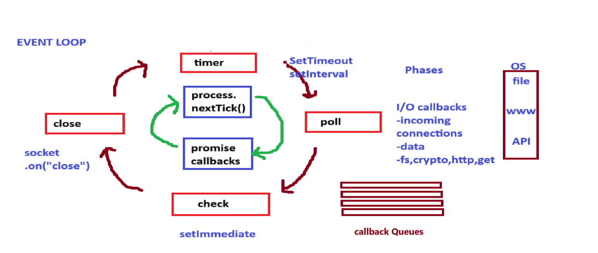
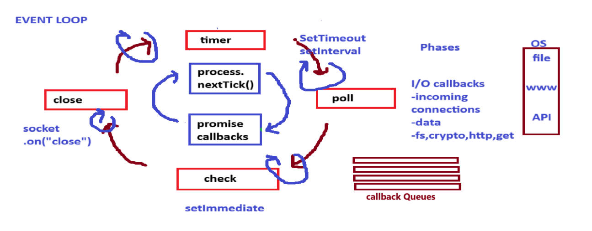
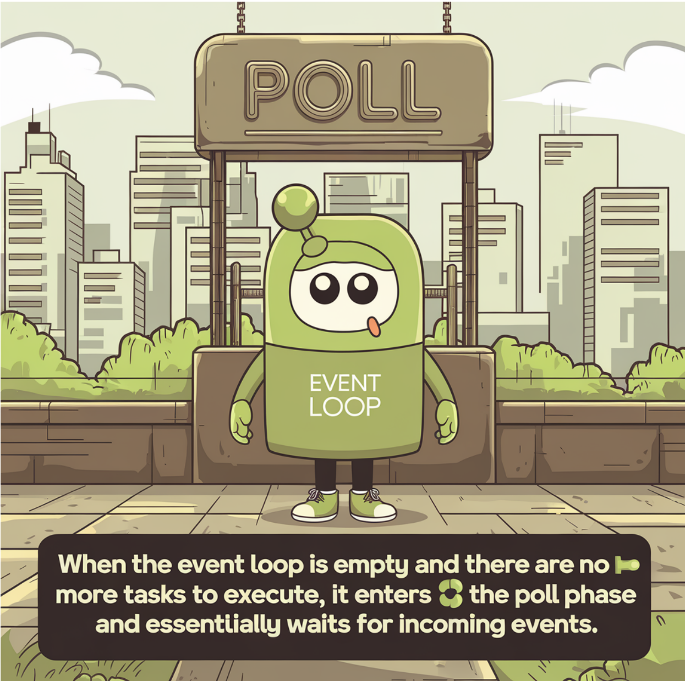

- We will use the libuv to do a Async task of the Nodejs.
- libuv is a librery which is handle all the Async task.

# Structure of the libuv
- There are basically 3 core things in the libuv.
    - (i) Callback Queue
    - (ii) Event loop
    - (iii) Thread pool

    ## (i) Callback Queue:
    - In the callback queue where we can store the callback after complete the operation.

    - There are also `priority queue for the process.nextTick() and promise.callback()`
    - When the callback is ready to execute in the main thread or in the V8 but if main thread will not empty then we cannot execute the callbacks.
    - So for check the main thread empty or not we use the event loop.

    ## (ii) Event Loop:
    - Event loop is also popular as a heart of the libuv.

    - It allows Node.js to perform non-blocking I/O operations, even though JavaScript is single-threaded. 
    - The main opration or work of the Event loop is to `check the callback queue` and `parellarly check the main thread`(Which is in the V8) status(empty or not for execute the Async callbackes).

    - ### Structure of the Event loop

        

    - from the image we see that there are main 4 stages of the event loop.
        - #### Stage:1 `timer` 
            - This is the innitial stage from where event loop starts.  
            - in this timer stage we have a two function which is execuded which is `setTimeout()` and `setInterval()`
        
        - #### Stage:2 `poll` 
            - After timers, the event loop enters the Poll phase, which is crucial because it handles I/O callbacks. For instance, when you perform a file read operation using `fs.readFile` , the callback associated with this I/O operation will be executed in this phase. The Poll phase is responsible for handling all I/O-related tasks, making it one of the most important phases in the event loop.
            - in this stage we have a `API request, file read, fs, crypto, http` ext.

        - #### Stage:3 `check` 
            - Next is the Check phase, where callbacks scheduled by the `setImmediate`  function are executed. This utility API allows you to execute  callbacks immediately after the Poll phase, giving you more control over the order of operations.

        - #### Stage:4 `close`   
            - Finally, in the Close Callbacks phase, any callbacks associated with closing operations, such as socket closures, are handled. This phase is typically used for cleanup tasks, ensuring that resources are properly released.


    - This is the very basic structure of the eventloop at the time of execution this is the half of the things.

    - Now we see the advance or actual way of how the eventloop works.

    

    - In the 2nd image we see that there are one another inner loop which has a `process.nextTick()` and `promise callback`
    - #### Full working path of the event loop
        - Check this one by one if present then send in the main thread otherwise move forward.

        - (1) process.nextTick()  
        - (2) promise callback
        - (3) timer 
        - (4) process.nextTick()
        - (5) promise callback
        - (6) poll 
        - (7) process.nextTick()
        - (8) promise callback
        - (9) check
        - (10) process.nextTick()
        - (11) promise callback

        ```js

        setimmediate(()=> console.log("setImmediate"));  
        setTimeout(() -> console.log("Timer expired"), 0);  
        Promise_resolve("promise").then(console.log);  
        fs.readFile("./file.txt", "utf8", () => (  setTimeout(() => console.log("2nd timer"), 0);  
        process-nextTick(() => console.logI"2nd nextTick"));  
        setImmediate(()=> console.log("2nd setImmediate"));  
        console.log("File reading CB");  D:  
        process.nextrick(() => console,log("Porcess.nextTick"));  
        console log("Last line of the file,");  

        

        ```

        ### Importent Concept of poll
        - When the `event loop is empty` and there are no more tasks to execute, it `enters the poll phase` and essentially waits for incoming events.
        - `NOTE`: At that time when the event loop is start then it execute in the clock wise which means that `check is executed before the timer.`

        


    ## (iii) Thread Pool: 
    - Suppose we have to do a Task like a file system (fs) operations, DNS lookups (Domain Name System), or cryptographic methods then we need a multiple thread to do this tasks but callstack(V8) has a only single thread so they give this to the libuv which is do this type of Async Task.
    - In the Thread pool we have a basically 4 thread which we can use as our needs but if we nned to change the number of the thread then we change them by using the `process.env.UV_THREADPOOL_SIZE = `

    - #### How Thread pool works?:
        -  suppose we have one file read task and one password encrypt (crypto) task parellal then libuv give this task to the thread pool and thread pool give them a saperate thread to do their work.
        - now as soon as complete the task that given thread free and threadpool give this callback to the callback queue and event loop work after that.
        - NOTE: `API calls cannnot need the Thread` which means that API call cannot use the threadpool.


    - For the more deep understanding refer the pdf 9 & 10.

- # JavaScript is single-threaded or multi-threaded? 
- This question has no single answer it is a based on the condition like,
    - if we have a code which is fully Sync then javascript is a single threaded because main thread(V8 or call stack) is a single threaded.
    - but if we have a mixed code with the Sync and Async task and in the Async thask we have do perticular tasks like file system (fs) operations, DNS lookups (Domain Name System), or cryptographic methods then javascript work as a multi-threaded launguage because we use the libuv and in the libuv we use the Thread pool which has contain multiple threads.


<!-- write the code explaination for that event loop at the end of the `Full working path of the event loop ` -->